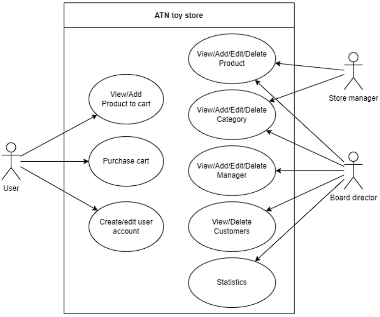

# Toy Store application description

## 1. Use case

**Store managers** can perform CRUD operations on categories and products, while **board directors** can also manage managers, customers, and access statistics from different store branches. **Users** can view and purchase products as well as manage their account.



## 2. Database

The application uses MongoDB as its database system. The design is as follow:


## 3. System access

The system can be accessed as 

- A director with (Will be directed to admin dashboard)
```
{
    "username": "BDAccount"
    "password": "admin"
}
```

- An user with (Will be directed to user homepage)
```
{
    "username": "user"
    "password": "user"
}
```

- A manager with (Will be directed to categories view)
```
{
    "username": "cyfylib"
    "password": "manager"
}
```

## 4. Pages

### 4.1. Admin pages


### 4.2. User pages

