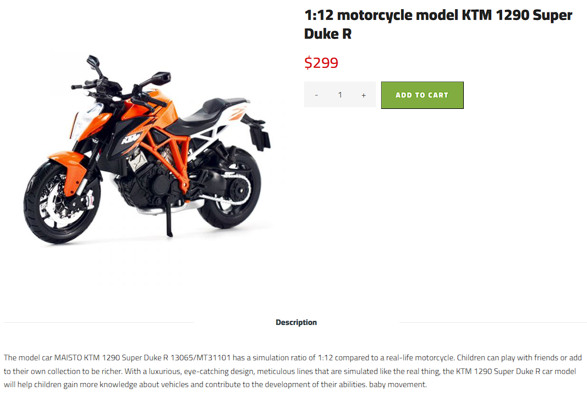

# Toy Store application description

Demo of this application can be accessed [HERE](https://toy-store-nguyenminhtriet.onrender.com) (May require sometime for the project to re-deploy)

## 1. Use case

**Store managers** can perform CRUD operations on categories and products, while **board directors** can also manage managers, customers, and access statistics from different store branches. **Users** can view and purchase products as well as manage their account.

<p align="center">
    
</p>

## 2. Database

The application uses MongoDB as its database system. The design is as follow:

<p align="center">
    
</p>

## 3. System access

The system can be accessed as 

- A director with (Will be directed to admin dashboard)
```
{
    "username": "BDAccount"
    "password": "admin"
}
```

- An user with (Will be directed to user homepage)
```
{
    "username": "user"
    "password": "user"
}
```

- A manager with (Will be directed to categories view)
```
{
    "username": "cyfylib"
    "password": "manager"
}
```

## 4. Pages

### 4.1. Admin pages

Admin pages are accessible for director and manager accounts. Here is the product page showing all the products in the database.

<p align="center">
    
</p>

This is the create product page allowing users to add product to the system both for admin pages sand for user pages.

<p align="center">
    
</p>

The image of the new product will be saved in the \public\img\products\ folder.

<p align="center">
    
</p>

A new record will be added to the product view page.

<p align="center">
    
</p>

The new product will also be updated to the user page.

<p align="center">
    
</p>

The view pages offers the ability to search for the corresponding item. Below is the search functionality implemented on products.

<p align="center">
    
</p>

Update and delete functionalities are similar to the add function. Both manager and director accounts can manage products and category. But only director accounts can manage manager accounts, view user accounts and dashboard. Here are the users and managers views.

<p align="center">
    
</p>

<p align="center">
    
</p>

The dashboard will allow directors to see the sales made. The following image shows products sold by different store branches.

<p align="center">
    
</p>

The next images shows the products sold of each store branch by date.

<p align="center">
    
</p>

The chart can be queried by date using the Show data from calender at the bottom of it as shown below.

<p align="center">
    
</p>

The last chart shows income of each store branch by date.

<p align="center">
    
</p>

This chart can also be queried to see income of each store branch in a particular month.

<p align="center">
    
</p>

Additionally, the system can prevent customers and managers from entering the dashboard page.

<p align="center">
    
</p>

### 4.2. User pages

This is the user homepage showing the categories offered by the store.

<p align="center">
    
</p>

Next is the shop page which will show all the product in the store.

<p align="center">
    
</p>

Users can click on any product in the shop page to see the details of the product.

<p align="center">
    
</p>

## 5. Technologies

- The application was developed in Microsoft Visual Code due to its lightweight feature and how easy it is to get started as well as its support for Heroku CLI and Git CLI.

- The server was run on Node.js and the framework used was Express thanks to its flexibility and a powerful feature set for web applications that it offers.

- The version control system (VCS) was GitHub to store and share our code between the members of the team because we were familiar with this technology from previous projects.

- The database for this application was MongoDB because it is a No-SQL database with the ability to manipulate and store data on a server rather than locally.

- The application was innitially deployed to Heroku, but due to recent policies changes, the free version of Heroku became unavailable so I hosted this application on Render.

#### More information on how we implemented this application and difficulties we faced can be found [HERE](https://drive.google.com/file/d/1VI8pZeliPoWPUXx5D3qV-kdBRMrosPXX/view?usp=sharing)